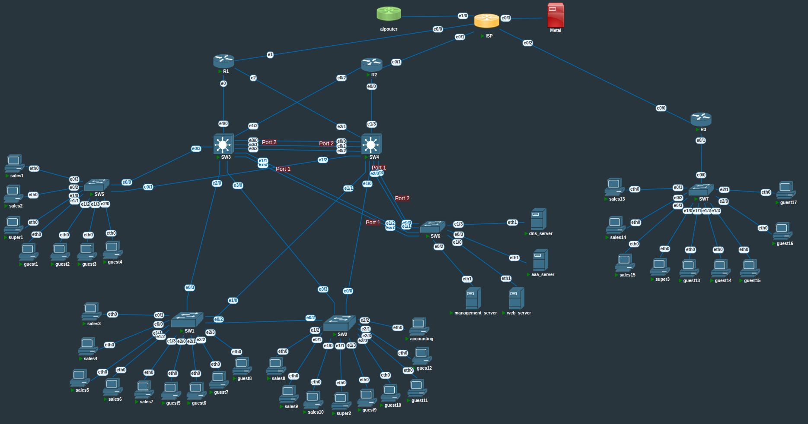

# Topology 1 Journal
This is a journal of my topology1 project. I also have python code implementing these solutions. Please see the gitrepo for the python code.
### Unusual Subnets
For this lab I will use 10.111.0.0/16 to represent the ISP owned network.
  
10.133.0.0/16 and other /16 subnets of the 10.0.0.0/8 block will remain private.
  
192.168.2.0/24 is used outside of the lab for my real LAN and will not be used in the lab besides the ISP node for internet access.

192.168.250.0/24 is used only for out of band communication. Generally think of a administrator using a laptop to interface with infrastructure devices.
### Proprietary Software Requirements
The Cisco simulated routers and switches are intended to run as CML 2.7 IOU devices running IOS xe. They are Dublin Version 17.12.1 IOS XE.
## Topology Summary
This topology has two sites. The topology represents a DIY retailer named TapeItUp. This company uses in-store web catalogues to compliment customer browsing. There is a main and outreach site.
  
domain name = tapeitup.private

The main site has at a minimum:
~~~
10 sales pcs
12 guest pcs
2 supervisor pcs at either end of the store
1 accounting pc
1 http server
1 aaa server
wifi for guest and sales
~~~
The outreach site has at a minimum: 
~~~
3 sales pcs
5 guest pcs
1 supervisor pc
~~~
The two sties must be able to securely communicate through their broadband ISP. The main site must have two redundant paths to their broadband ISP.
  
All devices have their hostname configured.

## Topology Data
### Container Pulls
~~~
adosztal/net_toolbox
adosztal/aaa
adosztal/dns
~~~
### All Container Config
~~~
ln -sf /usr/share/zoneinfo/Europe/London /etc/localtime
echo "Europe/London" > /etc/timezone
~~~
### ISP IPv4 Contract
These /32 host addresses are assigned by lab ISP
| Link | Inside Global |  | ISP Interface |
| :---: | :--: | :--: | :--: |
|R3-ISP| 10.111.10.30 | - | 10.111.10.31|
|R1-ISP| 10.111.10.10 |-|   10.111.10.11|
|R2-ISP| 10.111.10.20 |-|   10.111.10.21|
### Loopbacks IPv4 10.133.2.0/26
~~~
R1 10.133.2.1
R2 10.133.2.2
R3 10.133.2.3
SW3 10.133.2.13
SW4 10.133.2.14
~~~
### IPv4 Links in subnet 10.133.2.64/26
#### (.64 to .127) subnetted /31
|  |  |  | |
| :---: | :--: | :--: | :--: |
|R1-SW3     | 10.133.2.64     |-|   10.133.2.65 |
|R2-SW4     | 10.133.2.66     |-|   10.133.2.67 |
|R1-R3 VPN  | 10.133.2.68     |-|   10.133.2.69 |
|R2-R3 VPN  | 10.133.2.70     |-|   10.133.2.71 |
|R1-SW4     | 10.133.2.72     |-|   10.133.2.73 |
|R2-SW3     | 10.133.2.74     |-|   10.133.2.75 |
### Vlans & IPv4
Native VLAN = 933

#### vlan 10 sales 10.133.10.0/25 10.133.10.128/25
126 usable addresses
~~~
main: 10.133.10.0/25
SW3SVI: 10.133.10.124
SW4SVI: 10.133.10.125
HSRP-gate: 10.133.10.126
outreach: 10.133.10.128/25
gateway: 10.133.10.254
~~~
#### vlan 20 guest 10.133.20.0/23 10.133.22.0/24
510 usable addresses & 254 usable addresses
~~~
main: 10.133.20.0/23
SW3SVI: 10.133.21.252
SW4SVI: 10.133.21.253
HSRP-gate: 10.133.21.254
outreach: 10.133.22.0/24
gateway: 10.133.22.254
~~~
#### vlan 30 management 10.133.30.0/25 10.133.30.128/25
126 usable addresses
~~~
main: 10.133.30.0/25
management_server: 10.133.30.123
SW1SVI: 10.133.30.1
SW2SVI: 10.133.30.2
SW3SVI: 10.133.30.3
SW4SVI: 10.133.30.4
SW5SVI: 10.133.30.5
SW6SVI: 10.133.30.6
Site1_HSRP-gate: 10.133.30.126
outreach: 10.133.30.128/25
SW7SVI: 10.133.30.137
Site2_Gateway: 10.133.30.254
~~~

#### vlan 40 supervisor 10.133.40.0/25 10.133.40.128/25
126 usable addresses
~~~
main: 10.133.40.0/25
SW3SVI: 10.133.40.124
SW4SVI: 10.133.40.125
HSRP-gate: 10.133.40.126
outreach: 10.133.40.128/25
gateway: 10.133.40.254
~~~
#### vlan 60 guest-services 10.133.60.0/24
254 usable addresses
~~~
main: 10.133.60.0/24
dns_server: 10.133.60.250
web_server: 10.133.60.251
SW3SVI: 10.133.60.252
SW4SVI: 10.133.60.253
HSRP-gate: 10.133.60.254
~~~
#### vlan 70 internal-services 10.133.70.0/24
254 usable addresses
~~~
main: 10.133.70.0/24
prox1 10.133.70.231
ldap_server 10.133.70.250
aaa_server 10.133.70.251
SW3SVI: 10.133.70.252
SW4SVI: 10.133.70.253
HSRP-gate: 10.133.70.254
~~~
#### vlan 80 accounting 10.133.80.0/24
254 usable addresses
~~~
main: 10.133.80.0/24
SW3SVI: 10.133.80.252
SW4SVI: 10.133.80.253
HSRP-gate: 10.133.80.254
~~~
### IPv4 DHCP pools
#### Main Site:
| Subnet | Exclusion Start | | Exclusion End |
| :---: | :--: | :--: | :--: |
| 10.133.10.0/25 | 10.133.10.120 |-| 10.133.10.126 |
| 10.133.20.0/23 | 10.133.21.245 |-| 10.133.21.255 |
| 10.133.30.0/25 | 10.133.30.120 |-| 10.133.30.126 |
| 10.133.40.0/25 | 10.133.40.120 |-| 10.133.40.126 |
| 10.133.60.0/24 | 10.133.60.225 |-| 10.133.60.255 |
| 10.133.70.0/24 | 10.133.70.225 |-| 10.133.70.255 |
| 10.133.80.0/24 | 10.133.80.225 |-| 10.133.80.255 |
#### Outreach Site:
| Subnet | Exclusion Start | | Exclusion End |
| :---: | :--: | :--: | :--: |
| 10.133.10.128/25 | 10.133.10.250 |-| 10.133.10.255 |
| 10.133.22.0/24 | 10.133.22.245 |-| 10.133.22.255 |
| 10.133.30.128/25 | 10.133.30.250 |-| 10.133.30.255 |
| 10.133.40.128/25 | 10.133.40.250 |-| 10.133.40.255 |
### IPv6
When creating the IPv6 assignments I ensure the static addresses and DHCP address pool fall outside of SLAAC. I assign a large amount of amount of addresses to DHCP but I exclude 4 Bytes giving 65,536 addresses. I use /127 addresses for point to point links instead of just link-local. It is reproducible when replacing devices, it increases readability and ease of debugging. Unique local FC00::/7 would also work if internet is not required.
  
2001:db8:0:0000::/56 is subnetted as follows:
  
2001:db8:0:00ff::/64 is subnetted as follows:
#### Native Vlan is 933
~~~
R1-ISP: 2001:db8:0:00ff::fffe/127
R2-ISP: 2001:db8:0:00ff::fffc/127
ISP-R1: 2001:db8:0:00ff::ffff/127
ISP-R2: 2001:db8:0:00ff::fffd/127
ISP-R3 2001:db8:0:00ff::fffb/127
R3-ISP 2001:db8:0:00ff::fffa/127
ISP-metal 2001:db8:0:00ff::fff9/127
metal-ISP 2001:db8:0:00ff::fff8/127
ISP-alprouter 2001:db8:0:00ff::fff7/127
alprouter-ISP 2001:db8:0:00ff::fff6/127
R1-SW3 2001:db8:0:00ff::fff5/127
SW3-R1 2001:db8:0:00ff::fff4/127
R2-SW4 2001:db8:0:00ff::fff3/127
SW4-R2 2001:db8:0:00ff::fff2/127
R1-SW4 2001:db8:0:00ff::fff1/127
SW4-R1 2001:db8:0:00ff::fff0/127
R2-SW3 2001:db8:0:00ff::ffef/127
SW3-R2 2001:db8:0:00ff::ffee/127
~~~

2001:db8:0:0000::/60 is subnetted as follows:
#### Site 1 - Vlan 10 - sales
~~~
2001:db8:0:0001::/64
excluded-address 2001:db8:0:0001:: 2001:db8:0:0001::ffff
excluded-address 2001:db8:0:0001:0200:00ff:fe00:0000 2001:db8:0:0001:fdff:ffff:ffff:ffff
SW3SVI: 2001:db8:0:0001::3/64
SW4SVI: 2001:db8:0:0001::4/64
HSRP-gate: 2001:db8:0:0001::1/64
~~~
#### Site 1 - Vlan 20 - guest
~~~
2001:db8:0:0002::/64
excluded-address 2001:db8:0:0002:: 2001:db8:0:0002::ffff
excluded-address 2001:db8:0:0002:0200:00ff:fe00:0000 2001:db8:0:0002:fdff:ffff:feff:ffff
SW3SVI: 2001:db8:0:0002::3/64
SW4SVI: 2001:db8:0:0002::4/64
HSRP-gate: 2001:db8:0:0002::1/64
~~~
#### Site 1 - Vlan 30 - management
2001:db8:0:0003::/64 is subnetted as follows
~~~
SW1SVI: 2001:db8:0:0003::11/120
SW2SVI: 2001:db8:0:0003::12/120
SW3SVI: 2001:db8:0:0003::13/120
SW4SVI: 2001:db8:0:0003::14/120
SW5SVI: 2001:db8:0:0003::15/120
SW6SVI: 2001:db8:0:0003::16/120
management_server: 2001:db8:0:0003::a/120
HSRP-gate: 2001:db8:0:0003::1/120
R!: 2001:db8:0:0003::ff1/128
R2: 2001:db8:0:0003::ff2/128
~~~
#### Site 1 - Vlan 40 - supervisor
~~~
2001:db8:0:0004::/64
excluded-address 2001:db8:0:0004:: 2001:db8:0:0004::ffff
excluded-address 2001:db8:0:0004:0200:00ff:fe00:0000 2001:db8:0:0004:fdff:ffff:feff:ffff
SW3SVI: 2001:db8:0:0004::3/64
SW4SVI: 2001:db8:0:0004::4/64
HSRP-gate: 2001:db8:0:0004::1/64
~~~
#### Site 1 - Vlan 50 - voice
~~~
2001:db8:0:0005::/64
excluded-address 2001:db8:0:0005:: 2001:db8:0:0005::ffff
excluded-address 2001:db8:0:0005:0200:00ff:fe00:0000 2001:db8:0:0005:fdff:ffff:feff:ffff
SW3SVI: 2001:db8:0:0005::3/64
SW4SVI: 2001:db8:0:0005::4/64
HSRP-gate: 2001:db8:0:0005::1/64
~~~
#### Site 1 - Vlan 60 - guest services
~~~
2001:db8:0:0006::/64
excluded-address 2001:db8:0:0006:: 2001:db8:0:0006::ffff
excluded-address 2001:db8:0:0006:0200:00ff:fe00:0000 2001:db8:0:0006:fdff:ffff:feff:ffff
SW3SVI: 2001:db8:0:0006::3/64
SW4SVI: 2001:db8:0:0006::4/64
dns_server: 2001:db8:0:0006::2/64
web_server: 2001:db8:0:0006::5/64
HSRP-gate: 2001:db8:0:0006::1/64
~~~
#### Site 1 - Vlan 70 - internal services
~~~
2001:db8:0:0007::/64
excluded-address 2001:db8:0:0007:: 2001:db8:0:0007::ffff
excluded-address 2001:db8:0:0007:0200:00ff:fe00:0000 2001:db8:0:0007:fdff:ffff:feff:ffff
SW3SVI: 2001:db8:0:0007::3/64
SW4SVI: 2001:db8:0:0007::4/64
ldap_server 2001:db8:0:0007::5/64
aaa_server 2001:db8:0:0007::2/64
HSRP-gate: 2001:db8:0:0007::1/64
~~~
#### Site 1 - Vlan 80 - accounting
~~~
2001:db8:0:0008::/64
excluded-address 2001:db8:0:0008:: 2001:db8:0:0008::ffff
excluded-address 2001:db8:0:0008:0200:00ff:fe00:0000 2001:db8:0:0008:fdff:ffff:feff:ffff
SW3SVI: 2001:db8:0:0008::3/64
SW4SVI: 2001:db8:0:0008::4/64
HSRP-gate: 2001:db8:0:0008::1/64
~~~
2001:db8:0:0020::/60 is subnetted as follows:
#### Site 2 - Vlan 10
~~~
2001:db8:0:0021::/64
excluded-address 2001:db8:0:0021:: 2001:db8:0:0021::ffff
excluded-address 2001:db8:0:0021:0200:00ff:fe00:0000 2001:db8:0:0021:fdff:ffff:feff:ffff
Gateway: 2001:db8:0:0021::1/64
~~~
#### Site 2 - Vlan 20
~~~
2001:db8:0:0022::/64
excluded-address 2001:db8:0:0022:: 2001:db8:0:0022::ffff
excluded-address 2001:db8:0:0022:0200:00ff:fe00:0000 2001:db8:0:0022:fdff:ffff:feff:ffff
Gateway: 2001:db8:0:0022::1/64
~~~
#### Site 2 - Vlan 30
2001:db8:0:0023::/64 is subnetted as follows
~~~
SW7SVI: 2001:db8:0:0023::17/120
Gateway: 2001:db8:0:0023::1/120
R3: 2001:db8:0:0023::ff3/128
~~~
#### Site 2 - Vlan 40
~~~
2001:db8:0:0024::/64
excluded-address 2001:db8:0:0024:: 2001:db8:0:0024::ffff
excluded-address 2001:db8:0:0024:0200:00ff:fe00:0000 2001:db8:0:0024:fdff:ffff:feff:ffff
Gateway: 2001:db8:0:0024::1/64
~~~
### ISP Simulation
For internet access I exit the lab via the alpouter node. This performs nat66. For host machine access I exit the lab via the Metal node.
~~~
host ISP
ip domain-name ISP
access-list 1 permit 10.111.10.10
access-list 1 deny   any
access-list 2 permit 10.111.10.20
access-list 2 deny   any
access-list 3 permit 10.111.10.30
access-list 3 deny   any

no ip access-list extended NAT
!ip access-list extended NAT
!10 permit ip host 10.111.10.10 any
!20 permit ip host 10.111.10.11 any
!30 permit ip host 10.111.10.20 any
!40 permit ip host 10.111.10.21 any
!50 permit ip host 10.111.10.30 any
!60 permit ip host 10.111.10.31 any
!10000 deny ip any any
!exit

ip routing
ipv6 unicast

!ISP-R1 
interface e0/0
ip access-group 1 in
ip add 10.111.10.11 255.255.255.254
ipv6 enable
ipv6 add 2001:db8:0:00ff::ffff/127
no shutdown
!ip nat inside

!ISP-R2
interface e0/1
ip access-group 2 in
ip add 10.111.10.21 255.255.255.254
ipv6 enable
ipv6 add 2001:db8:0:00ff::fffd/127
no shutdown
!ip nat inside

!ISP-R3 2001:db8:0:00ff::fffb/127
interface e0/2
ip access-group 3 in
ip add 10.111.10.31 255.255.255.254
ipv6 enable
ipv6 add 2001:db8:0:00ff::fffb/127
no shutdown
!ip nat inside

!ISP-metal 2001:db8:0:00ff::fff9/127
!interface e0/3
!ip address 192.168.2.245 255.255.255.0
!ipv6 enable
!no shutdown
!ip nat outside
!ipv6 add 2001:db8:0:00ff::fff9/127
!exit

! ISP-alprouter 2001:db8:0:00ff::fff7/127
interface e1/0
ip address 10.111.111.110 255.255.255.0
ipv6 enable
no shutdown
ipv6 add 2001:db8:0:00ff::fff7/127
exit

ip route 0.0.0.0 0.0.0.0 10.111.111.111
ipv6 route 0::/0 e1/0 2001:db8:0:00ff::fff6
ipv6 route 2001:db8:0:0000::/60 e0/0 2001:db8:0:00ff::fffe
ipv6 route 2001:db8:0:0000::/60 e0/1 2001:db8:0:00ff::fffa 5
ipv6 route 2001:db8:0:0020::/60 e0/2 2001:db8:0:00ff::fffc

!route-map NAT permit 10
!match ip address NAT
!exit

!ip nat inside source route NAT interface e0/3 overload
~~~
### Topology Diagram (Draft)
It is not good quality. I will look at creating a proper diagram in the future.

## Ether-channel
There are three ether-channels in the topology. SW6 connecting to the two distribution layer switches is layer 2. I initially planned the two distribution switches interconnecting as layer 3, but I realised that could cause extra traffic. If the root bridge SVI and HSRP master did not match it would cause layer 2 traffic to switch avoiding port-channel 2. Really this would only occur due to misconfiguration or hardware failures outside of preemption windows for HSRP. Regardless I configured it as a layer 2 link.

I configure SW6-SW3 as LACP. Active & passive are the LACP keywords. active-active is a little slower to negotiate than active-passive.
#### SW6 Config
~~~
interface r e0/1, e1/2
channel-group 1 mode active
~~~
#### SW3 Config 
~~~
interface r e1/0, e1/1
channel-group 1 mode active
~~~
  
I configure SW6-SW4 as PAGP
#### SW6 Config
~~~
interface r e1/1,e0/0
channel-group 2 mode desirable
~~~
#### SW4 Config
~~~
interface r e2/0,e0/3
channel-group 1 mode desirable
~~~
  
I configure SW3-SW4 as LACP
#### SW3 Config
~~~
interface r e0/0-2
channel-group 2 mode active
~~~
#### SW4 Config
~~~
interface r e0/0-2
channel-group 2 mode active
~~~

#### Testing
I view my ether-channels with show ether-channel summary. They all report as layer 2 since I haven't used **no switchport** on the port-channels.

## VLANs
VLANs are outlined in the Topology Data section. I will not be using VTP in my configuration. Trunk encapsulation is dot1q in modern networks. R3 needs to act as a router on a stick. The sub-interfaces act as default gateways much like SVI's. They will be assigned layer 3 addresses in a different section.

#### Switch 1-7 Config
~~~
vlan 10
name sales
vlan 20
name guest
vlan 30
name management
vlan 40
name supervisor
vlan 50
name voice
vlan 60
name guest-services
vlan 70
name internal-services
vlan 80
name accounting
vlan 933
name native
exit
~~~

#### SW1 Config
~~~
interface r e0/1,e0/0,e1/1,e1/2,e1/3
switchport access vlan 10
switchport mode access
switchport nonegotiate
interface r e2/0,e2/1,e2/2,e2/3
switchport access vlan 20
switchport mode access
switchport nonegotiate
interface r e0/3,e1/0,e0/2
switchport trunk encapsulation dot1q
switchport trunk allowed vlan 10,20,30,40,50
switchport trunk native vlan 933
switchport mode trunk
switchport nonegotiate
exit
~~~

#### SW2 Config
~~~
interface r e1/2,e0/1,e1/0
switchport access vlan 10
switchport mode access
switchport nonegotiate
interface r e1/3,e2/0,e2/1,e2/3
switchport access vlan 20
switchport mode access
switchport nonegotiate
interface e1/1
switchport access vlan 40
switchport mode access
switchport nonegotiate
interface e2/2
switchport access vlan 80
switchport mode access
switchport nonegotiate
interface r e0/3,e0/0,e0/2
switchport trunk encapsulation dot1q
switchport trunk allowed vlan 10,20,30,40,50
switchport trunk native vlan 933
switchport mode trunk
switchport nonegotiate
exit
~~~
  
The two distribution layer switches will need SVI's at layer 3. They will act as the layer 3 gateways. Layer 3 configuration is in a different section.
#### SW3 Config
~~~
interface e0/3
switchport trunk allowed vlan 10,20,30,40
interface e2/0
switchport trunk allowed vlan 10,20,30
interface e3/0
switchport trunk allowed vlan 10,20,30,40,80
interface port 1
switchport trunk allowed vlan 30,60,70
interface port 2
switchport trunk allowed vlan 10,20,30,40,50,60,70,80
interface r e0/3,e2/0,e3/0,port 1, port 2
switchport trunk encapsulation dot1q
switchport trunk native vlan 933
switchport mode trunk
switchport nonegotiate
exit
~~~

#### SW4 Config
~~~
interface e1/2
switchport trunk allowed vlan 10,20,30,40
interface e1/1
switchport trunk allowed vlan 10,20,30
interface e1/0
switchport trunk allowed vlan 10,20,30,40,80
interface port 1
switchport trunk allowed vlan 30,60,70
interface port 2
switchport trunk allowed vlan 10,20,30,40,50,60,70,80
interface r e1/2,e1/1,e1/0,port 1, port 2
switchport trunk encapsulation dot1q
switchport trunk native vlan 933
switchport mode trunk
switchport nonegotiate
exit
~~~

#### SW5 Config
~~~
interface r e0/3,e0/2
switchport access vlan 10
switchport mode access
switchport nonegotiate
interface r e1/1,e1/2,e1/3,e2/0
switchport access vlan 20
switchport mode access
switchport nonegotiate
interface e1/0
switchport access vlan 40
switchport mode access
switchport nonegotiate
interface r e0/0,e0/1
switchport trunk encapsulation dot1q
switchport trunk allowed vlan 10,20,30,40,50
switchport trunk native vlan 933
switchport mode trunk
switchport nonegotiate
exit
~~~

#### SW6 Config
~~~
interface e0/2
switchport access vlan 30
switchport mode access
switchport nonegotiate
interface r e1/0,e1/3
switchport access vlan 60
switchport mode access
switchport nonegotiate
interface e0/3
switchport access vlan 70
switchport mode access
switchport nonegotiate
interface r port 1,port 2
switchport trunk encapsulation dot1q
switchport trunk allowed vlan 30,60,70
switchport trunk native vlan 933
switchport mode trunk
switchport nonegotiate
exit
~~~

#### SW7 Config
~~~
interface r e0/1,e0/2,e0/3
switchport access vlan 10
switchport mode access
switchport nonegotiate
interface r e1/1,e1/2,e1/3,e2/0,e2/1
switchport access vlan 20
switchport mode access
switchport nonegotiate
interface e1/0
switchport access vlan 40
switchport mode access
switchport nonegotiate
interface e0/0
switchport trunk encapsulation dot1q
switchport trunk allowed vlan 10,20,30,40
switchport trunk native vlan 933
switchport mode trunk
switchport nonegotiate
~~~
#### R3 Config
~~~
interface e0/1
no shutdown
interface e0/1.10
encapsulation dot1Q 10
interface e0/1.20
encapsulation dot1Q 20
interface e0/1.30
encapsulation dot1Q 30
interface e0/1.40
encapsulation dot1Q 40
exit
~~~
#### Testing
**show vlan brief** displays the vlan assignments. **Show interface trunk** is another good command for confirming the trunk config.

## STP
For STP I want different ports blocking per VLAN to help reduce unnecessary congestion. I configure Rapid PVST+. I configure SW3 as root for sales and supervisor. I configure SW4 as root for guest and the others.

#### SW3 Config
~~~
spanning-tree mode rapid-pvst
spanning-tree vlan 10 priority 0
spanning-tree vlan 20 priority 4096
spanning-tree vlan 30 priority 4096
spanning-tree vlan 40 priority 0
spanning-tree vlan 50 priority 4096
spanning-tree vlan 60 priority 4096
spanning-tree vlan 70 priority 4096
spanning-tree vlan 80 priority 4096
~~~
#### SW4 Config
~~~
spanning-tree mode rapid-pvst
spanning-tree vlan 10 priority 4096
spanning-tree vlan 20 priority 0
spanning-tree vlan 30 priority 0
spanning-tree vlan 40 priority 4096
spanning-tree vlan 50 priority 0
spanning-tree vlan 60 priority 0
spanning-tree vlan 70 priority 0
spanning-tree vlan 80 priority 0
~~~
#### SW1,SW2,SW5,SW6 Config
~~~~
spanning-tree mode rapid-pvst
~~~~
#### Testing
I can clearly see the root bridge status and the port roles in this excerpt for each vlan. The switch is correctly root in certain vlans and not others. I can also see the port channel is lower cost.
~~~
VLAN0010
  Spanning tree enabled protocol rstp
  Root ID    Priority    10
             Address     aabb.cc00.0600
             This bridge is the root
             Hello Time   2 sec  Max Age 20 sec  Forward Delay 15 sec

  Bridge ID  Priority    10     (priority 0 sys-id-ext 10)
             Address     aabb.cc00.0600
             Hello Time   2 sec  Max Age 20 sec  Forward Delay 15 sec
             Aging Time  300 sec

Interface           Role Sts Cost      Prio.Nbr Type
------------------- ---- --- --------- -------- --------------------------------
Et0/3               Desg FWD 100       128.4    P2p 
Et2/0               Desg FWD 100       128.9    P2p 
Et3/0               Desg FWD 100       128.13   P2p 
Po2                 Desg FWD 47        128.66   P2p 

          
VLAN0020information
  Spanning tree enabled protocol rstp
  Root ID    Priority    20
             Address     aabb.cc00.0700
             Cost        47
             Port        66 (Port-channel2)
             Hello Time   2 sec  Max Age 20 sec  Forward Delay 15 sec

  Bridge ID  Priority    4116   (priority 4096 sys-id-ext 20)
             Address     aabb.cc00.0600
             Hello Time   2 sec  Max Age 20 sec  Forward Delay 15 sec
             Aging Time  300 sec

Interface           Role Sts Cost      Prio.Nbr Type
------------------- ---- --- --------- -------- --------------------------------
Et0/3               Desg FWD 100       128.4    P2p 
Et2/0               Desg FWD 100       128.9    P2p 
Et3/0               Desg FWD 100       128.13   P2p 
Po2                 Root FWD 47        128.66   P2p
~~~

## IPv4
I configure gateway addresses for R3 sub-interfaces. This is where all the outreach site traffic will be routed between VLANs. I create vlan SVI's on SW3 & SW4. This is where the main site traffic will be routed between VLAN's. HSRP will provide a redundant gateway address between the distribution switch SVI's. I am using /31 for subnets with two devices. This should be supported by all the network devices.

#### R1 Config
~~~
interface g1
ip add 10.133.2.64 255.255.255.254
no shutdown
interface g2
ip add 10.111.10.10 255.255.255.254
no shutdown
interface g3
ip add 10.133.2.72 255.255.255.254
no shutdown
interface lo0
ip add 10.133.2.1 255.255.255.255
no shutdown
exit
~~~
#### R2 Config
~~~
interface e0/0
ip add 10.133.2.66 255.255.255.254
no shutdown
interface e0/1
ip add 10.111.10.20 255.255.255.254
no shutdown
interface e0/2
ip add 10.133.2.74 255.255.255.254
no shutdown
interface lo0
ip add 10.133.2.2 255.255.255.255
no shutdown
exit
~~~
#### R3 Config
~~~
interface e0/1
no shutdown
interface e0/1.10
ip add 10.133.10.254 255.255.255.128
interface e0/1.20
ip add 10.133.22.254 255.255.255.0
interface e0/1.30
ip add 10.133.30.254 255.255.255.128
interface e0/1.40
ip add 10.133.40.254 255.255.255.128
interface lo0
ip add 10.133.2.3 255.255.255.255
no shutdown
interface e0/0
ip add 10.111.10.30 255.255.255.254
no shutdown
exit
~~~

#### SW1 Config
~~~
no ip routing
ip default-gateway 10.133.30.126
interface vlan 30 
ip add 10.133.30.1 255.255.255.128
no shutdown
exit
~~~
#### SW2 Config
~~~
no ip routing
ip default-gateway 10.133.30.126
interface vlan 30
ip add 10.133.30.2 255.255.255.128
no shutdown
exit
~~~
#### SW3 Config
~~~
ip routing
interface vlan 10
ip add 10.133.10.124 255.255.255.128
no shutdown
interface vlan 20
ip add 10.133.21.252 255.255.254.0
no shutdown
interface vlan 30
ip add 10.133.30.3 255.255.255.128
no shutdown
interface vlan 40
ip add 10.133.40.124 255.255.255.128
no shutdown
interface vlan 60
ip add 10.133.60.252 255.255.255.0
no shutdown
interface vlan 70
ip add 10.133.70.252 255.255.255.0
no shutdown
interface vlan 80
ip add 10.133.80.252 255.255.255.0
no shutdown
interface e4/0
no switchp
ip add 10.133.2.65 255.255.255.254
interface e1/2
no switchp
ip add 10.133.2.75 255.255.255.254
no shutdown
interface lo0
ip add 10.133.2.13 255.255.255.255
no shutdown
exit
~~~

#### SW4 Config
~~~
ip routing
interface vlan 10
ip add 10.133.10.125 255.255.255.128
no shutdown
interface vlan 20
ip add 10.133.21.253 255.255.254.0
no shutdown
interface vlan 30
ip add 10.133.30.4 255.255.255.128
no shutdown
interface vlan 40
ip add 10.133.40.125 255.255.255.128
no shutdown
interface vlan 60
ip add 10.133.60.253 255.255.255.0
no shutdown
interface vlan 70
ip add 10.133.70.253 255.255.255.0
no shutdown
interface vlan 80
ip add 10.133.80.253 255.255.255.0
interface e1/3
no switchp
ip add 10.133.2.67 255.255.255.254
no shutdown
interface e2/1
no switchp
ip add 10.133.2.73 255.255.255.254
no shutdown
interface lo0
ip add 10.133.2.14 255.255.255.255
no shutdown
exit
~~~

#### SW5 Config
~~~
no ip routing
ip default-gateway 10.133.30.126
interface vlan 30 
ip add 10.133.30.5 255.255.255.128
no shutdown
exit
~~~

#### SW6 Config
~~~
no ip routing
ip default-gateway 10.133.30.126
interface vlan 30 
ip add 10.133.30.6 255.255.255.128
no shutdown
exit
~~~

#### SW7 Config
~~~
no ip routing
ip default-gateway 10.133.30.254
interface vlan 30 
ip add 10.133.30.137 255.255.255.128
no shutdown
exit
~~~

#### Testing
I can check this config using **show ip int brief** on device.

## First Hop Redundancy - HSRP
I configure HSRP for first hop redundancy. Without HSRP, losing a distribution switch would knock out the single gateway that must be assigned on hosts. With HSRP either switch can act as the gateway for traffic between subnets. For HSRP the priority will match the STP root bridges. SW3 interface vlan 10 & interface vlan 40 will be priority. SW4 will be priority for all the other vlan SVI HSRP processes. The id will match the vlan id. The switches have a delay before they try to preempt their master state of 60secs. This is to mitigate excessive outages due to flapping. The timers are set much lower than default resulting in faster convergence at the cost of bandwidth and stability. The 650 hold time with 200 hello means that the switch would likely have to miss 3 consecutive hello frames before taking over.

#### SW3 Config
~~~
interface vlan 10
standby ip 10.133.10.126
standby preempt delay rel 60
standby priority 200
standby 0 timers msec 200 msec 650
interface vlan 20
standby ip 10.133.21.254
standby preempt delay rel 60
standby priority 111
standby 0 timers msec 200 msec 650
interface vlan 30
standby ip 10.133.30.126
standby preempt delay rel 60
standby priority 111
standby 0 timers msec 200 msec 650
interface vlan 40
standby ip 10.133.40.126
standby preempt delay rel 60
standby priority 200
standby 0 timers msec 200 msec 650
interface vlan 60
standby ip 10.133.60.254
standby preempt delay rel 60
standby priority 111
standby 0 timers msec 200 msec 650
interface vlan 70
standby ip 10.133.70.254
standby preempt delay rel 60
standby priority 111
standby 0 timers msec 200 msec 650
interface vlan 80
standby ip 10.133.80.254
standby preempt delay rel 60
standby priority 111
standby 0 timers msec 200 msec 650
exit
~~~

#### SW4 Config
~~~
interface vlan 10
standby ip 10.133.10.126
standby preempt delay rel 60
standby priority 111
standby 0 timers msec 200 msec 650
interface vlan 20
standby ip 10.133.21.254
standby preempt delay rel 60
standby priority 200
standby 0 timers msec 200 msec 650
interface vlan 30
standby ip 10.133.30.126
standby preempt delay rel 60
standby priority 200
standby 0 timers msec 200 msec 650
interface vlan 40
standby ip 10.133.40.126
standby preempt delay rel 60
standby priority 111
standby 0 timers msec 200 msec 650
interface vlan 60
standby ip 10.133.60.254
standby preempt delay rel 60
standby priority 200
standby 0 timers msec 200 msec 650
interface vlan 70
standby ip 10.133.70.254
standby preempt delay rel 60
standby priority 200
standby 0 timers msec 200 msec 650
interface vlan 80
standby ip 10.133.80.254
standby preempt delay rel 60
standby priority 200
standby 0 timers msec 200 msec 650
exit
~~~

#### Testing
Using **show standby** I can get the info I need to verify HSRP is operating as intended.
  
Example SW3 excerpt:
~~~
Preemption enabled, delay reload 60 secs
  Active router is local
  Standby router is 10.133.10.125, priority 111 (expires in 0.688 sec)
~~~

## OSPF
I enable OSPF on the layer 3 devices. I disable OSPF advertisements on the WAN interfaces. In a later section I intend to use OSPF over vpn connections to the outreach site. 
I set the SVI's as passive besides Vlan 30 management. Both R1 and R2 are advertising the default route but the route cost will depend on who is the HSRP gateway for VLAN 30. I set the reference cost to 100k to avoid gigabit links having the same bandwidth as 100 megabit links. All of the network is single area. The ISP doesn't participate in OSPF. Default gateways direct traffic that doesn't belong in the LAN on either site to the ISP.
#### R1 Config
~~~
ip route 0.0.0.0 0.0.0.0 10.111.10.11
ip route 0.0.0.0 0.0.0.0 10.111.10.21 8
router ospf 1
auto-cost reference-bandwidth 100000
default-information originate
passive-interface e0/1

network 10.111.10.10 0.0.0.1 a 0
network 10.133.2.1 0.0.0.0 a 0
network 10.133.2.64 0.0.0.1 a 0
network 10.133.2.72 0.0.0.1 a 0

exit
~~~
#### R2 Config 
~~~
ip route 0.0.0.0 0.0.0.0 10.111.10.11 8
ip route 0.0.0.0 0.0.0.0 10.111.10.21
router ospf 1
auto-cost reference-bandwidth 100000
default-information originate
passive-interface e0/1

network 10.111.10.20 0.0.0.1 a 0
network 10.133.2.2 0.0.0.0 a 0
network 10.133.2.66 0.0.0.1 a 0
network 10.133.2.74 0.0.0.1 a 0

exit
~~~
#### R3 Config
~~~
ip route 0.0.0.0 0.0.0.0 10.111.10.31
router ospf 1
auto-cost reference-bandwidth 100000
default-information originate

passive-interface e0/1
passive-interface e0/1.10
passive-interface e0/1.20
passive-interface e0/1.30
passive-interface e0/1.40

network 10.111.10.30 0.0.0.1 a 0
network 10.133.2.3 0.0.0.0 a 0
network 10.133.10.128 0.0.0.127 a 0
network 10.133.22.0 0.0.0.255 a 0
network 10.133.30.128 0.0.0.127 a 0
network 10.133.40.128 0.0.0.127 a 0

exit
~~~

#### SW3 Config
~~~
ip routing
router ospf 1
auto-cost reference-bandwidth 100000

network 10.133.2.64 0.0.0.1 a 0
network 10.133.2.74 0.0.0.1 a 0
network 10.133.2.13 0.0.0.0 a 0
network 10.133.10.0 0.0.0.127 area 0
network 10.133.20.0 0.0.1.255 area 0
network 10.133.30.0 0.0.0.127 area 0
network 10.133.40.0 0.0.0.127 area 0
network 10.133.60.0 0.0.0.255 area 0
network 10.133.70.0 0.0.0.255 area 0
network 10.133.80.0 0.0.0.255 area 0

passive-interface Vlan10
passive-interface Vlan20
passive-interface Vlan40
passive-interface Vlan60
passive-interface Vlan70
passive-interface Vlan80

exit
~~~

#### SW4 Config
~~~
ip routing
router ospf 1
auto-cost reference-bandwidth 100000

network 10.133.2.66 0.0.0.1 a 0
network 10.133.2.72 0.0.0.1 a 0
network 10.133.2.14 0.0.0.0 a 0
network 10.133.10.0 0.0.0.127 area 0
network 10.133.20.0 0.0.1.255 area 0
network 10.133.30.0 0.0.0.127 area 0
network 10.133.40.0 0.0.0.127 area 0
network 10.133.60.0 0.0.0.255 area 0
network 10.133.70.0 0.0.0.255 area 0
network 10.133.80.0 0.0.0.255 area 0

passive-interface Vlan10
passive-interface Vlan20
passive-interface Vlan40
passive-interface Vlan60
passive-interface Vlan70
passive-interface Vlan80

exit
~~~

## Cisco DHCP (Non-Redundant)
I have decided to use SW3(main) and R3(outreach) as the DHCP servers. Note the SW3 selection creates a single point of failure and may stress the hardware. This is the logical choice out of CCNA level topics I believe. A backup should be considered in the future.
  
SW4 SVI will be configured with a helper address so SW4 forwards DHCP traffic to the server on SW3. If SW3 goes down then clients in the main site will be unable to use DHCP.
  
As specified in topology data section each vlan has an excluded address range for static IP assignment.
#### R3 Config
~~~
ip dhcp excluded-address 10.133.10.250 10.133.10.255
ip dhcp excluded-address 10.133.22.245 10.133.22.255
ip dhcp excluded-address 10.133.40.250 10.133.40.255
ip dhcp pool 10
network 10.133.10.128 /25
default-router 10.133.10.254
domain-name tapeitup.private
dns-server 10.133.60.250 1.1.1.1
ip dhcp pool 22
network 10.133.22.0 /24
default-router 10.133.22.254
domain-name tapeitup.private
dns-server 10.133.60.250 1.1.1.1
ip dhcp pool 40
network 10.133.40.128 /25
default-router 10.133.40.254
domain-name tapeitup.private
dns-server 10.133.60.250 1.1.1.1
~~~
#### SW3 Config
~~~
ip dhcp excluded-address 10.133.10.120 10.133.10.126
ip dhcp excluded-address 10.133.21.245 10.133.21.255
ip dhcp excluded-address 10.133.40.120 10.133.40.126
ip dhcp excluded-address 10.133.80.225 10.133.80.255
ip dhcp pool 10
network  10.133.10.0 /25
default-router 10.133.10.126
domain-name tapeitup.private
dns-server 10.133.60.250 1.1.1.1
exit
ip dhcp pool 20
network 10.133.20.0 /23
default-router 10.133.21.254
domain-name tapeitup.private
dns-server 10.133.60.250 1.1.1.1
exit
ip dhcp pool 40
network 10.133.40.0 /25
default-router 10.133.40.126
domain-name tapeitup.private
dns-server 10.133.60.250 1.1.1.1
exit
ip dhcp pool 80
network 10.133.80.0 /24
default-router 10.133.80.254
domain-name tapeitup.private
dns-server 10.133.60.250 1.1.1.1
exit
~~~
#### SW4 Config
~~~
interface r vl 10-80
ip helper-address 10.133.2.13
~~~

## NAT + WAN ACL
I configure dynamic NAT. I configure port address translation. I configure an access list to permit any host on the LAN to be translated.
  
Initially I left NAT as "permit any". However after debugging the VPN I discovered that it will not work if the NAT ACL includes ANY summarisation of the crypto map list matching traffic. My assumption was that the more specific ACL entry would take precedence, but that is clearly false.

#### R1 Config
~~~
ip access-list extended NAT
10 permit ip 10.133.0.0 0.0.255.255 192.168.2.0 0.0.0.255
20 deny ip 10.133.0.0 0.0.255.255 10.133.0.0 0.0.255.255
30 permit ip 10.133.0.0 0.0.255.255 any
10000 deny ip any any
exit

ip nat inside source list NAT interface g2 overload

ip access-list extended WAN_FILTER
10 deny ip 224.0.0.0 15.255.255.255 any
20 deny ip any 224.0.0.0 15.255.255.255
10000 permit ip host 10.111.10.10 any
100000 deny ip any any log
exit

interface r g1,g3
ip nat inside
interface g2
ip nat outside
ip access-group WAN_FILTER out
exit
~~~

#### R2 Config
~~~
ip access-list extended NAT
10 permit ip 10.133.0.0 0.0.255.255 192.168.2.0 0.0.0.255
20 deny ip 10.133.0.0 0.0.255.255 10.133.0.0 0.0.255.255
30 permit ip 10.133.0.0 0.0.255.255 any
10000 deny ip any any
exit

ip nat inside source list NAT interface ethernet 0/1 overload

ip access-list extended WAN_FILTER
10 deny ip 224.0.0.0 15.255.255.255 any
20 deny ip any 224.0.0.0 15.255.255.255
10000 permit ip host 10.111.10.10 any
100000 deny ip any any log
exit

interface e0/0
ip nat inside
interface Ethernet0/1
ip nat outside
ip access-group WAN_FILTER out
exit
~~~

#### R3 Config
~~~
ip access-list extended NAT
10 permit ip 10.133.0.0 0.0.255.255 192.168.2.0 0.0.0.255
20 deny ip 10.133.0.0 0.0.255.255 10.133.0.0 0.0.255.255
30 permit ip 10.133.0.0 0.0.255.255 any
10000 deny ip any any
exit

ip nat inside source list NAT interface ethernet 0/0 overload

ip access-list extended WAN_FILTER
10 deny ip 224.0.0.0 15.255.255.255 any
20 deny ip any 224.0.0.0 15.255.255.255
10000 permit ip host 10.111.10.10 any
100000 deny ip any any log
exit

interface e0/1
ip nat inside
interface Ethernet0/0
ip nat outside
ip access-group WAN_FILTER out
exit
~~~

#### Test
I test by pinging 10.111.10.11 from guest0

~~~
VPCS> ip dhcp
DDORA IP 10.133.10.1/25 GW 10.133.10.126

VPCS> ping 10.111.10.11

84 bytes from 10.111.10.11 icmp_seq=1 ttl=253 time=1.187 ms
~~~

I can view the translations with **show ip nat translations**. This is an excerpt:
~~~
Pro Inside global      Inside local       Outside local      Outside global
icmp 10.111.10.10:16507 10.133.10.1:16507 10.111.10.11:16507  10.111.10.11:16507
icmp 10.111.10.10:16763 10.133.10.1:16763 10.111.10.11:16763  10.111.10.11:16763
icmp 10.111.10.10:17019 10.133.10.1:17019 10.111.10.11:17019  10.111.10.11:17019
icmp 10.111.10.10:17275 10.133.10.1:17275 10.111.10.11:17275  10.111.10.11:17275
icmp 10.111.10.10:17531 10.133.10.1:17531 10.111.10.11:17531  10.111.10.11:17531
~~~

## VPN - IPSec - PSK with OSPF
IPSec is a secure VPN technology. It doesn't support multicast unless I combine with GRE. Multicast is not essential for OSPF as I can manually specify the neighbour. I made sure to use the interface Tunnel0 as it simplifies the config. It is essential to have the same policy at either end. Advertising the endpoints WAN port over the VPN using OSPF will cause flapping or errors. I use static routes to ensure the WAN ports preferred route remains outside VPN. The WAN port over VPN routes are still available in the OSPF process, but I see no reason they would be used instead of a static route with default ad.
#### R1 Config
~~~
crypto isakmp policy 10
en aes 256
auth pre-share
group 14
lifetime 3600
exit

crypto isakmp key vpnsecretkey13 address 10.111.10.30

crypto ipsec transform-set ESP-AES256-SHA esp-aes 256 esp-sha-hmac 
mode tunnel
exit

ip access-list extended vpn_traff
deny ip any 192.168.2.0 0.0.0.255
permit ip 10.133.0.0 0.0.255.255 10.133.0.0 0.0.255.255
exit

crypto ipsec profile VPNPROFILE
set transform-set ESP-AES256-SHA

interface Tunnel0
ip address 10.133.2.68 255.255.255.254
ip ospf network point-to-point
tunnel source g2
tunnel mode ipsec ipv4
tunnel destination 10.111.10.30
tunnel protection ipsec profile VPNPROFILE
no shutdown
exit

ip route 10.111.10.20 255.255.255.255 10.111.10.11
ip route 10.111.10.30 255.255.255.255 10.111.10.11

router ospf 1
network 10.133.2.68 0.0.0.1 a 0
exit
~~~
#### R2 Config
~~~
crypto isakmp policy 10
en aes 256
auth pre-share
group 14
lifetime 3600
exit

crypto isakmp key vpnsecretkey23 address 10.111.10.30

crypto ipsec transform-set ESP-AES256-SHA esp-aes 256 esp-sha-hmac 
mode tunnel
exit

ip access-list extended vpn_traff
deny ip any 192.168.2.0 0.0.0.255
permit ip 10.133.0.0 0.0.255.255 10.133.0.0 0.0.255.255
exit

crypto ipsec profile VPNPROFILE
set transform-set ESP-AES256-SHA

interface Tunnel0
ip address 10.133.2.70 255.255.255.254
tunnel source Ethernet0/1
ip ospf network point-to-point
tunnel mode ipsec ipv4
tunnel destination 10.111.10.30
tunnel protection ipsec profile VPNPROFILE
no shutdown
exit

ip route 10.111.10.10 255.255.255.255 10.111.10.21
ip route 10.111.10.30 255.255.255.255 10.111.10.21

router ospf 1
network 10.133.2.70 0.0.0.1 a 0
exit
~~~
#### R3 Config
~~~
crypto isakmp policy 10
en aes 256
auth pre-share
group 14
lifetime 3600
exit

crypto isakmp key vpnsecretkey13 address 10.111.10.10
crypto isakmp key vpnsecretkey23 address 10.111.10.20

crypto ipsec transform-set ESP-AES256-SHA esp-aes 256 esp-sha-hmac 
mode tunnel
exit

crypto ipsec profile VPNPROFILE
set transform-set ESP-AES256-SHA

ip access-list extended vpn_traff
deny ip any 192.168.2.0 0.0.0.255
permit ip 10.133.0.0 0.0.255.255 10.133.0.0 0.0.255.255
exit

interface tunnel 0
ip address 10.133.2.69 255.255.255.254
tunnel source e0/0
tunnel mode ipsec ipv4
ip ospf network point-to-point
tunnel protection ipsec profile VPNPROFILE
tunnel destination 10.111.10.10
no shutdown

interface tunnel 1
ip address 10.133.2.71 255.255.255.254
tunnel source e0/0
tunnel mode ipsec ipv4
ip ospf network point-to-point
tunnel protection ipsec profile VPNPROFILE
tunnel destination 10.111.10.20
no shutdown
exit

ip route 10.111.10.10 255.255.255.255 10.111.10.31
ip route 10.111.10.20 255.255.255.255 10.111.10.31

router ospf 1
network 10.133.2.68 0.0.0.1 a 0
network 10.133.2.70 0.0.0.1 a 0
exit
~~~

## Vlan Access Control (incomplete)
I use access control to enhance security by preventing unauthorised traffic traveling between VLANs. 
  
All VLANs will be unable route to the management VLAN.

### Main Site
#### Vlan 10 Main
~~~
ip access-list ex vlan10_filter
10 permit   ip 10.133.10.0  0.0.0.127  10.133.10.0    0.0.0.127
20 permit   ip 10.133.10.0  0.0.0.127  10.133.10.128  0.0.0.127
30 permit   ip 10.133.10.0  0.0.0.127  10.133.60.0    0.0.0.255
40 permit   ip 10.133.10.0  0.0.0.127  10.133.70.0    0.0.0.255
50 permit   tcp 10.133.10.0 0.0.0.127  10.133.30.0   0.0.0.127 established

1000 deny   ip any 10.133.0.0 0.0.255.255
2000 permit ip 10.133.10.0 0.0.0.255 any
~~~
#### Vlan 20 Main
~~~
ip access-list ex vlan20_filter
10 permit   ip 10.133.20.0  0.0.1.255  10.133.20.0   0.0.1.255
20 permit   ip 10.133.20.0  0.0.1.255  10.133.22.0   0.0.0.255
30 permit   ip 10.133.20.0  0.0.1.255  10.133.60.0   0.0.0.255
40 permit   tcp 10.133.20.0 0.0.1.255  10.133.30.0   0.0.0.127 established

1000 deny     ip any 10.133.0.0 0.0.255.255
2000 permit   ip 10.133.20.0 0.0.0.255 any
~~~
#### Vlan 30 Main
vlan 30 can establish ssh connections
~~~
ip access-list ex vlan30_filter
10 permit   ip 10.133.30.0  0.0.0.127  10.133.30.0    0.0.0.127
20 permit   ip 10.133.30.0  0.0.0.127  10.133.30.128  0.0.0.127

130 permit   tcp 10.133.30.0 0.0.0.127  10.133.10.0    0.0.0.127 eq 22
140 permit   tcp 10.133.30.0 0.0.0.127  10.133.10.128  0.0.0.127 eq 22
150 permit   tcp 10.133.30.0 0.0.0.127  10.133.20.0    0.0.1.255 eq 22
160 permit   tcp 10.133.30.0 0.0.0.127  10.133.22.0    0.0.0.255 eq 22
170 permit   tcp 10.133.30.0 0.0.0.127  10.133.40.0    0.0.0.127 eq 22
180 permit   tcp 10.133.30.0 0.0.0.127  10.133.40.128  0.0.0.127 eq 22

1000 deny     ip any 10.133.0.0 0.0.255.255
2000 permit   ip 10.133.30.0 0.0.0.255 any
~~~
#### Vlan 40 Main
~~~
ip access-list ex vlan40_filter
10 permit   ip 10.133.40.0  0.0.0.127  10.133.40.0    0.0.0.127
20 permit   ip 10.133.40.0  0.0.0.127  10.133.40.128  0.0.0.127
30 permit   ip 10.133.40.0  0.0.0.127  10.133.60.0    0.0.0.255
40 permit   ip 10.133.40.0  0.0.0.127  10.133.70.0    0.0.0.255
50 permit   tcp 10.133.40.0 0.0.0.127  10.133.30.0   0.0.0.127 established

1000 deny     ip any 10.133.0.0 0.0.255.255
2000 permit   ip 10.133.40.0 0.0.0.255 any
~~~

#### web_server_access
outgoing
~~~
1000 permit tcp any any eq 443
2000 permit tcp any any eq www
~~~

#### dns_server_access
outgoing
~~~
1000 permit ip 10.133.0.0 0.0.255.255
deny any any 
~~~
#### aaa_server_access
outgoing
~~~
1000 permit ip 10.133.0.0 0.0.255.255
deny any any 
~~~

#### management_server_access
outgoing
~~~
100 permit ip 10.133.30.0 0.0.0.255

1000 deny     ip any 10.133.0.0 0.0.255.255
2000 permit   ip 10.133.30.0 0.0.0.255 any
~~~

~~~
ip access-list ex vlan_filter
deny    ip 10.133.10.0 0.0.0.255 10.133.20.0 0.0.1.255
deny    ip 10.133.10.0 0.0.0.255 10.133.22.0 0.0.0.255
deny    ip 10.133.10.0 0.0.0.255 10.133.30.0 0.0.0.255
deny    ip 10.133.10.0 0.0.0.255 10.133.40.0 0.0.0.255
permit  ip 10.133.10.0 0.0.0.255 10.133.60.0 0.0.0.255
permit  ip 10.133.10.0 0.0.0.255 10.133.70.0 0.0.0.255
deny    ip 10.133.10.0 0.0.1.255 10.133.80.0 0.0.0.255

deny ip   10.133.20.0 0.0.1.255 10.133.10.0 0.0.0.255
deny ip   10.133.20.0 0.0.1.255 10.133.30.0 0.0.0.255
deny ip   10.133.20.0 0.0.1.255 10.133.40.0 0.0.0.255
permit ip 10.133.20.0 0.1.0.255 10.133.60.0 0.0.0.255
deny ip   10.133.20.0 0.0.1.255 10.133.70.0 0.0.0.255
deny ip   10.133.20.0 0.0.1.255 10.133.80.0 0.0.0.255

deny ip   10.133.22.0 0.0.0.255 10.133.10.0 0.0.0.255
deny ip   10.133.22.0 0.0.0.255 10.133.30.0 0.0.0.255
deny ip   10.133.22.0 0.0.0.255 10.133.40.0 0.0.0.255
permit ip 10.133.22.0 0.0.0.255 10.133.60.0 0.0.0.255
deny ip   10.133.22.0 0.0.0.255 10.133.70.0 0.0.0.255
deny ip   10.133.22.0 0.0.0.255 10.133.80.0 0.0.0.255

deny ip 10.133.30.0 0.0.0.255 10.133.10.0 0.0.0.255
deny ip 10.133.30.0 0.0.0.255 10.133.20.0 0.0.1.255
deny ip 10.133.30.0 0.0.0.255 10.133.22.0 0.0.0.255
deny ip 10.133.30.0 0.0.0.255 10.133.40.0 0.0.0.255
deny ip 10.133.30.0 0.0.0.255 10.133.50.0 0.0.0.255
deny ip 10.133.30.0 0.0.0.255 10.133.60.0 0.0.0.255
deny ip 10.133.30.0 0.0.0.255 10.133.70.0 0.0.0.255
deny ip 10.133.30.0 0.0.0.255 10.133.80.0 0.0.0.255
deny ip 10.133.30.0 0.0.0.127 any log

deny ip   10.133.40.0 0.0.0.255 10.133.20.0 0.0.1.255
deny ip   10.133.40.0 0.0.0.255 10.133.22.0 0.0.0.255
deny ip   10.133.40.0 0.0.0.255 10.133.30.0 0.0.0.255
permit ip 10.133.40.0 0.0.0.255 10.133.60.0 0.0.0.255
permit ip 10.133.40.0 0.0.0.255 10.133.70.0 0.0.0.255
deny ip   10.133.40.0 0.0.0.255 10.133.80.0 0.0.0.255

deny ip 10.133.70.0 0.0.0.255 10.133.20.0 0.0.1.255
deny ip 10.133.70.0 0.0.0.255 10.133.22.0 0.0.0.255
deny ip 10.133.70.0 0.0.0.255 10.133.30.0 0.0.0.255

deny ip 10.133.80.0 0.0.0.255 10.133.20.0 0.0.1.255
deny ip 10.133.80.0 0.0.0.255 10.133.22.0 0.0.0.255
deny ip 10.133.80.0 0.0.0.255 10.133.30.0 0.0.0.255

permit udp 10.133.30.0 0.0.0.127 ip any eq ntp
permit ip any any

ip access-list ex service_filter
permit ip 10.133.30.0 0.0.0.255 any
permit tcp any host 10.133.60.251 eq www
permit udp 10.133.0.0 0.0.255.255 host 10.133.60.250 eq domain
deny any any
~~~

## Access Layer Security
I enable port security. For each port I use the default of max 1 mac address and leave the default shutdown violation. This prevents MAC flooding. There are no ip phones to share access ports. I enable DHCP snooping which prevents hosts from acting like a DHCP server. I enable DAI to ensure ARP traffic is correct for static and DHCP address assignments. Additionally I assign unused ports to an unused vlan, disable dtp, assign access and shutdown.

#### SW1 Config
~~~
ip dhcp snooping vlan 10,20,40,80
no ip dhcp snoop info opt
ip dhcp snooping

arp access-list ARP_ACL
permit ip host 10.133.10.124 mac host aabb.cc80.0600
permit ip host 10.133.10.125 mac host aabb.cc80.0700
permit ip host 10.133.10.126 mac host 0000.0c07.ac00

permit ip host 10.133.21.252 mac host aabb.cc80.0600
permit ip host 10.133.21.253 mac host aabb.cc80.0700
permit ip host 10.133.21.254 mac host 0000.0c07.ac00

permit ip host 10.133.40.124 mac host aabb.cc80.0600
permit ip host 10.133.40.125 mac host aabb.cc80.0700
permit ip host 10.133.40.126 mac host 0000.0c07.ac00

permit ip host 10.133.80.252 mac host aabb.cc80.0600
permit ip host 10.133.80.253 mac host aabb.cc80.0700
permit ip host 10.133.80.254 mac host 0000.0c07.ac00

ip arp inspection filter HSRP_ARP_ACL vlan 10
ip arp inspection filter HSRP_ARP_ACL vlan 20
ip arp inspection filter HSRP_ARP_ACL vlan 40
ip arp inspection filter HSRP_ARP_ACL vlan 80

ip arp inspection vlan 10,20,40,80
interface r e0/1,e1/1,e1/2,e1/3
switchport port-s

interface r e2/0,e2/1,e2/2,e2/3
switchport port-s

interface r e0/3,e1/0,e0/2
ip dhcp snooping trust
ip arp inspection trust

interface range ethernet 3/0 - 3
    switchport mode access
    switchport access vlan 911
    switchport nonegotiate
    shutdown
exit
~~~

#### SW2 Config
~~~
ip dhcp snooping vlan 10,20,40,80
no ip dhcp snoop info opt
ip dhcp snooping
ip arp inspection vlan 10,20,40,80

arp access-list ARP_ACL
permit ip host 10.133.10.124 mac host aabb.cc80.0600
permit ip host 10.133.10.125 mac host aabb.cc80.0700
permit ip host 10.133.10.126 mac host 0000.0c07.ac00

permit ip host 10.133.21.252 mac host aabb.cc80.0600
permit ip host 10.133.21.253 mac host aabb.cc80.0700
permit ip host 10.133.21.254 mac host 0000.0c07.ac00

permit ip host 10.133.40.124 mac host aabb.cc80.0600
permit ip host 10.133.40.125 mac host aabb.cc80.0700
permit ip host 10.133.40.126 mac host 0000.0c07.ac00

permit ip host 10.133.80.252 mac host aabb.cc80.0600
permit ip host 10.133.80.253 mac host aabb.cc80.0700
permit ip host 10.133.80.254 mac host 0000.0c07.ac00

ip arp inspection filter HSRP_ARP_ACL vlan 10
ip arp inspection filter HSRP_ARP_ACL vlan 20
ip arp inspection filter HSRP_ARP_ACL vlan 40
ip arp inspection filter HSRP_ARP_ACL vlan 80

interface r e1/2,e0/1,e1/0
switchport port-s
ip arp inspection limit rate 100

interface r e1/3,e2/0,e2/1,e2/3
switchport port-s
ip arp inspection limit rate 100

interface e1/1
switchport port-s
ip arp inspection limit rate 100

interface e2/2
switchport port-s
ip arp inspection limit rate 100

interface r e0/3,e0/0,e0/2
ip dhcp snooping trust
ip arp inspection trust
exit

interface range ethernet 3/0 - 3
    switchport mode access
    switchport access vlan 911
    switchport nonegotiate
    shutdown
~~~

#### SW5 Config
~~~
ip dhcp snooping vlan 10,20,40,80
no ip dhcp snoop info opt
ip dhcp snooping
ip arp inspection vlan 10,20,40,80

arp access-list ARP_ACL
permit ip host 10.133.10.124 mac host aabb.cc80.0600
permit ip host 10.133.10.125 mac host aabb.cc80.0700
permit ip host 10.133.10.126 mac host 0000.0c07.ac00

permit ip host 10.133.21.252 mac host aabb.cc80.0600
permit ip host 10.133.21.253 mac host aabb.cc80.0700
permit ip host 10.133.21.254 mac host 0000.0c07.ac00

permit ip host 10.133.40.124 mac host aabb.cc80.0600
permit ip host 10.133.40.125 mac host aabb.cc80.0700
permit ip host 10.133.40.126 mac host 0000.0c07.ac00

permit ip host 10.133.80.252 mac host aabb.cc80.0600
permit ip host 10.133.80.253 mac host aabb.cc80.0700
permit ip host 10.133.80.254 mac host 0000.0c07.ac00

ip arp inspection filter HSRP_ARP_ACL vlan 10
ip arp inspection filter HSRP_ARP_ACL vlan 20
ip arp inspection filter HSRP_ARP_ACL vlan 40
ip arp inspection filter HSRP_ARP_ACL vlan 80

interface r e0/3,e0/2
switchport port-s
ip arp inspection limit rate 100

interface r e1/1,e1/2,e1/3,e2/0
switchport port-s
ip arp inspection limit rate 100

interface e1/0
switchport port-s
ip arp inspection limit rate 100

interface r e0/0,e0/1
ip dhcp snooping trust
ip arp inspection trust
exit

interface range ethernet 2/1 - 3
    switchport mode access
    switchport access vlan 911
    switchport nonegotiate
    shutdown
interface range ethernet 3/0 - 3
    switchport mode access
    switchport access vlan 911
    switchport nonegotiate
    shutdown

~~~

#### SW6 Config
~~~
interface e0/2
switchport port-s
interface r e1/0,e1/3
switchport port-s
interface e0/3
switchport port-s
exit

interface range ethernet 2/0 - 3
    switchport mode access
    switchport access vlan 911
    switchport nonegotiate
    shutdown
interface range ethernet 3/0 - 3
    switchport mode access
    switchport access vlan 911
    switchport nonegotiate
    shutdown
~~~

#### SW7 Config
~~~
ip dhcp snooping vlan 10,20,40,80
no ip dhcp snoop info opt
ip dhcp snooping
ip arp inspection vlan 10,20,40,80

arp access-list ARP_ACL
permit ip host 10.133.10.254 mac host aabb.cc00.0a10
permit ip host 10.133.22.254 mac host aabb.cc00.0a10
permit ip host 10.133.40.124 mac host aabb.cc00.0a10
permit ip host 10.133.80.252 mac host aabb.cc00.0a10

ip arp inspection filter HSRP_ARP_ACL vlan 10
ip arp inspection filter HSRP_ARP_ACL vlan 20
ip arp inspection filter HSRP_ARP_ACL vlan 40
ip arp inspection filter HSRP_ARP_ACL vlan 80

interface r e0/1,e0/2,e0/3
switchport port-s
ip arp inspection limit rate 100

interface r e1/1,e1/2,e1/3,e2/0,e2/1
switchport port-s
ip arp inspection limit rate 100

interface e1/0
switchport port-s
ip arp inspection limit rate 100

interface e0/0
ip dhcp snooping trust
ip arp inspection trust
exit

interface range ethernet 2/2 - 3
    switchport mode access
    switchport access vlan 911
    switchport nonegotiate
    shutdown
interface range ethernet 3/0 - 3
    switchport mode access
    switchport access vlan 911
    switchport nonegotiate
    shutdown
~~~

#### SW3 Config
~~~
interface range ethernet 1/3
    switchport mode access
    switchport access vlan 911
    switchport nonegotiate
    shutdown
interface range ethernet 3/1 - 3
    switchport mode access
    switchport access vlan 911
    switchport nonegotiate
    shutdown
interface range ethernet 4/1 - 3
    switchport mode access
    switchport access vlan 911
    switchport nonegotiate
    shutdown
interface range ethernet 5/0 - 3
    switchport mode access
    switchport access vlan 911
    switchport nonegotiate
    shutdown

~~~
#### SW4 Config
~~~
interface range ethernet 2/2 - 3
    switchport mode access
    switchport access vlan 911
    switchport nonegotiate
    shutdown
interface range ethernet 3/0 - 3
    switchport mode access
    switchport access vlan 911
    switchport nonegotiate
    shutdown
interface range ethernet 4/0 - 3
    switchport mode access
    switchport access vlan 911
    switchport nonegotiate
    shutdown
interface range ethernet 5/0 - 3
    switchport mode access
    switchport access vlan 911
    switchport nonegotiate
    shutdown

~~~

## NTP
I ensure minimal discrepancy in the time reported by my LAN devices. For this, I configure R1 to sync to an internet ntp server. The rest of the devices I configure to sync to R1 first and 1.1.1.1 if R1 fails.
First I configure the devices to have the correct timezone.

#### R1 Config
~~~
clock timezone GMT 0
clock summer-time BST recurring last Sun Mar 1:00 last Sun Oct 2:00
ntp authenticate
ntp authentication-key 1 md5 outoftime
ntp trusted-key 1
ntp server 1.1.1.1
ntp master
ntp update-calendar
ntp source l0
~~~

#### R2+R3 Config
~~~
clock timezone GMT 0
clock summer-time BST recurring last Sun Mar 1:00 last Sun Oct 2:00
ntp authenticate
ntp authentication-key 1 md5 outoftime
ntp trusted-key 1
ntp server 10.133.2.1 key 1 prefer
ntp server 1.1.1.1
ntp update-calendar
ntp source l0
~~~
#### Switchs Config
~~~
clock timezone GMT 0
clock summer-time BST recurring last Sun Mar 1:00 last Sun Oct 2:00
ntp authenticate
ntp authentication-key 1 md5 outoftime
ntp trusted-key 1
ntp server 10.133.2.1 key 1 prefer
ntp server 1.1.1.1
ntp update-calendar
ntp source vlan 30
~~~
~~~
clock timezone GMT 0
clock summer-time BST recurring last Sun Mar 1:00 last Sun Oct 2:00
~~~

## IPv6 Addressing + HSRP v2
Version 2 is the HSRP version that supports ipv6.
#### R1 Config
~~~
ipv6 unicast-routing

interface g1
ipv6 enable
ipv6 add 2001:db8:0:ff::fff5/127
no shutdown
exit

interface l0
ipv6 enable
ipv6 add 2001:db8:0:3::ff1/128
no shutdown
exit

interface g2
ipv6 enable
ipv6 add 2001:db8:0:ff::fffe/127
no shutdown
exit

interface g3
ipv6 enable
ipv6 add 2001:db8:0:ff::fff1/127
no shutdown
exit
~~~
#### R2 Config
~~~
ipv6 unicast-routing

interface e0/1
ipv6 enable
ipv6 add 2001:db8:0:00ff::fffa/127

interface l0
ipv6 enable
ipv6 add 2001:db8:0:3::ff2/128

interface e0/0
ipv6 enable
ipv6 add 2001:db8:0:00ff::fff3/127
no shutdown

interface e0/2
ipv6 enable
ipv6 add 2001:db8:0:00ff::ffef/127
no shutdown
exit
~~~
#### R3 Config
~~~
ipv6 unicast-routing

interface e0/0
ipv6 enable
ipv6 add 2001:db8:0:00ff::fffc/127 

interface l0
ipv6 enable
ipv6 add 2001:db8:0:23::ff3/128

interface e0/1.10
ipv6 enable
ipv6 add 2001:db8:0:21::1/64

interface e0/1.20
ipv6 enable
ipv6 add 2001:db8:0:22::1/64

interface e0/1.30
ipv6 enable
ipv6 add 2001:db8:0:23::1/120

interface e0/1.40
ipv6 enable
ipv6 add 2001:db8:0:24::1/64
exit
~~~

#### SW1 Config
~~~
ipv6 unicast-routing
interface vlan 30
ipv6 enable
ipv6 add 2001:db8:0:0003::11/120
exit
~~~
#### SW2 Config
~~~
ipv6 unicast-routing
interface vlan 30
ipv6 enable
ipv6 add 2001:db8:0:0003::12/120
exit
~~~

#### SW3 Config
~~~
ipv6 unicast-routing

interface vlan 30
ipv6 enable
ipv6 add 2001:db8:0:0003::13/120
standby version 2
standby 1 timers msec 200 msec 650
standby 1 priority 111
standby 1 preempt delay reload 60
standby 1 ipv6 2001:db8:0:0003::1/120

interface vlan 10
ipv6 enable
ipv6 add 2001:db8:0:0001::3/64
standby version 2
standby 1 timers msec 200 msec 650
standby 1 priority 200
standby 1 preempt delay reload 60
standby 1 ipv6 2001:db8:0:0001::1/64

interface vlan 20
ipv6 enable
ipv6 add 2001:db8:0:0002::3/64
standby version 2
standby 1 timers msec 200 msec 650
standby 1 priority 111
standby 1 preempt delay reload 60
standby 1 ipv6 2001:db8:0:0002::1/64

interface vlan 40
ipv6 enable
ipv6 add 2001:db8:0:0004::3/64
standby version 2
standby 1 timers msec 200 msec 650
standby 1 priority 200
standby 1 preempt delay reload 60
standby 1 ipv6 2001:db8:0:0004::1/64

interface vlan 60
ipv6 enable
ipv6 add 2001:db8:0:0006::3/64
standby version 2
standby 1 timers msec 200 msec 650
standby 1 priority 111
standby 1 preempt delay reload 60
standby 1 ipv6 2001:db8:0:0006::1/64

interface vlan 70
ipv6 enable
ipv6 add 2001:db8:0:0007::3/64
standby version 2
standby 1 timers msec 200 msec 650
standby 1 priority 111
standby 1 preempt delay reload 60
standby 1 ipv6 2001:db8:0:0007::1/64

interface vlan 80
ipv6 enable
ipv6 add 2001:db8:0:0008::3/64
standby version 2
standby 1 timers msec 200 msec 650
standby 1 priority 111
standby 1 preempt delay reload 60
standby 1 ipv6 2001:db8:0:0008::1/64
exit

interface e4/0
ipv6 enable
ipv6 add 2001:db8:0:00ff::fff4/127
no shutdown
exit
interface e1/2
ipv6 enable
ipv6 add 2001:db8:0:00ff::ffee/127
no shutdown
exit
~~~

#### SW4 Config
~~~
ipv6 unicast-routing
interface vlan 30
ipv6 enable
ipv6 add 2001:db8:0:0003::14/120
standby version 2
standby 1 timers msec 200 msec 650
standby 1 priority 200
standby 1 preempt delay reload 60
standby 1 ipv6 2001:db8:0:0003::1/120

interface vlan 10
ipv6 enable
ipv6 add 2001:db8:0:0001::4/64
standby version 2
standby 1 timers msec 200 msec 650
standby 1 priority 111
standby 1 preempt delay reload 60
standby 1 ipv6 2001:db8:0:0001::1/64

interface vlan 20
ipv6 enable
ipv6 add 2001:db8:0:0002::4/64
standby version 2
standby 1 timers msec 200 msec 650
standby 1 priority 200
standby 1 preempt delay reload 60
standby 1 ipv6 2001:db8:0:0002::1/64

interface vlan 40
ipv6 enable
ipv6 add 2001:db8:0:0004::4/64
standby version 2
standby 1 timers msec 200 msec 650
standby 1 priority 111
standby 1 preempt delay reload 60
standby 1 ipv6 2001:db8:0:0004::1/64

interface vlan 60
ipv6 enable
ipv6 add 2001:db8:0:0006::4/64
standby version 2
standby 1 timers msec 200 msec 650
standby 1 priority 200
standby 1 preempt delay reload 60
standby 1 ipv6 2001:db8:0:0006::1/64

interface vlan 70
ipv6 enable
ipv6 add 2001:db8:0:0007::4/64
standby version 2
standby 1 timers msec 200 msec 650
standby 1 priority 200
standby 1 preempt delay reload 60
standby 1 ipv6 2001:db8:0:0007::1/64

interface vlan 80
ipv6 enable
ipv6 add 2001:db8:0:0008::4/64
standby version 2
standby 1 timers msec 200 msec 650
standby 1 priority 200
standby 1 preempt delay reload 60
standby 1 ipv6 2001:db8:0:0008::1/64
exit

interface e1/3
ipv6 enable
ipv6 add 2001:db8:0:00ff::fff2/127
no shutdown
exit
interface e1/3
ipv6 enable
ipv6 add 2001:db8:0:00ff::fff0/127
no shutdown
exit
~~~

#### SW5 Config
~~~
ipv6 unicast-routing
interface vlan 30
ipv6 enable
ipv6 add 2001:db8:0:0003::15/120
exit
~~~

#### SW6 Config
~~~
ipv6 unicast-routing
interface vlan 30
ipv6 enable
ipv6 add 2001:db8:0:0003::16/120
exit
~~~

#### SW7 Config
~~~
ipv6 unicast-routing
interface vlan 30
ipv6 enable
ipv6 add 2001:db8:0:23::17/120
exit
~~~

## IPv6 Static routes
Note IPv6 traffic between the two sites is not encrypted like IPv4 is. This is beyond CCNA. In reality this would be a major security issue.
#### R1
~~~
ipv6 route 0::/0 g2 2001:db8:0:ff::ffff
ipv6 route 2001:db8::/60 g1 2001:db8:0:ff::fff4
ipv6 route 2001:db8::/60 g3 2001:db8:0:ff::fff0 9

ipv6 route 2001:db8:0:03::ff2/128 g1 2001:db8:0:ff::fff4
~~~
#### R2
~~~
ipv6 route 0::/0 e0/1 2001:db8:0:ff::fffd
ipv6 route 2001:db8::/60 e0/0 2001:db8:0:ff::fff2
ipv6 route 2001:db8::/60 e0/2 2001:db8:0:ff::ffee 9

ipv6 route 2001:db8:0:03::ff1/128 e0/0 2001:db8:0:ff::fff2
~~~
#### R3
~~~
ipv6 route 0::/0 e0/0 2001:db8:0:00ff::fffb
~~~
#### SW1
~~~
ipv6 route ::0/0 2001:DB8:0:3::1
~~~
#### SW2
~~~
ipv6 route ::0/0 2001:DB8:0:3::1
~~~
#### SW3
~~~
ipv6 route 0::/0 e4/0 2001:db8:0:ff::fff5
ipv6 route 0::/0 e1/2 2001:db8:0:ff::ffef 9
ipv6 route 2001:db8:0:03::ff1/128 e4/0 2001:db8:0:ff::fff5
ipv6 route 2001:db8:0:03::ff2/128 2001:db8:0:3::14
ipv6 route 2001:db8:0:ff::fffc/127 2001:db8:0:3::14
ipv6 route 2001:db8:0:ff::fff2/127 2001:db8:0:3::14
~~~
#### SW4
~~~
ipv6 route 0::/0 e1/3 2001:db8:0:00ff::fff3
ipv6 route 0::/0 e2/1 2001:db8:0:ff::fff1 9
ipv6 route 2001:db8:0:03::ff1/128 2001:db8:0:3::13
ipv6 route 2001:db8:0:03::ff2/128 e1/3 2001:db8:0:ff::fff3
ipv6 route 2001:db8:0:ff::fffe/127 2001:db8:0:3::13
ipv6 route 2001:db8:0:ff::fff4/127 2001:db8:0:3::13
~~~
#### SW5
~~~
ipv6 route ::0/0 2001:DB8:0:3::1
~~~
#### SW6
~~~
ipv6 route ::0/0 2001:DB8:0:3::1
~~~
#### SW7
~~~
ipv6 route ::0/0 2001:DB8:0:23::1
~~~

## SSH
All network devices have a hostname and domain name TapeItUp. The password is not secure enough to be used in a non lab enviroment.

#### Debian Client Connect
~~~
ssh -o KexAlgorithms=+diffie-hellman-group14-sha1 -o MACs=hmac-sha1 -o HostKeyAlgorithms=+ssh-rsa -o PubkeyAcceptedKeyTypes=+ssh-rsa 2001:db8:0:3::ff2 -l lab
~~~
#### Router and Switch Config
~~~
username lab privilege 15 secret bal
username auto privilege 15 secret otua
service password-encryption

ip ssh dh min size 2048
crypto key generate rsa modulus 2048 label ssh
ip ssh rsa keypair-name ssh
ip ssh version 2
ip ssh server algorithm encryption aes256-ctr
ip ssh server algorithm mac hmac-sha1

line vty 0 4
transp in ssh
login local
exec-timeout 0 0
exit
~~~

## Ansible Example
For an initial demo of ansible I create a SSH playbook to change the banner on the device.
The local user authentication is used.
When I run the playbook with ansible it sucessfully changes the banner on R2.
#### Playbook testssh.yaml
~~~
---
- name: play1
  hosts: testssh
  gather_facts: no
  tasks:
    - name: Print connection details
      debug:
        msg: "Connecting to {{ ansible_host }} with user {{ ansible_user }} and password {{ ansible_password }}"

    - name: Add Banner using ios_banner via SSH
      cisco.ios.ios_banner:
        banner: login
        text: this was configured with ansible via ssh
        state: present
    - name: Add Banner using ios_banner via SSH
      cisco.ios.ios_banner:
        banner: login
        text: this was configured with ansible via ssh
        state: present
~~~
#### inventory.yaml
~~~
---
all:
  children:
    testnetconf:
      hosts:
        2001:db8:0:3::ff1:
          ansible_host: 2001:db8:0:3::ff1
          ansible_user: auto
          ansible_password: otua
          ansible_connection: netconf
          ansible_network_os: ios
          netconf_port: 830
          ansible_become: yes
          ansible_become_method: enable
          ansible_become_password: otua
    testssh:
      hosts:
        2001:db8:0:3::ff2:
          ansible_host: 2001:db8:0:3::ff1
          ansible_user: auto
          ansible_password: otua
          ansible_connection: network_cli
          ansible_network_os: ios
          ansible_ssh_common_args: '-o StrictHostKeyChecking=no -o KexAlgorithms=+diffie-hellman-group14-sha1 -o MACs=hmac-sha1 -o HostKeyAlgorithms=+ssh-rsa -o PubkeyAcceptedKeyTypes=+ssh-rsa'
          ansible_become: yes
          ansible_become_method: enable
          ansible_become_password: otua
    testrestconf:
      hosts:
        2001:db8:0:3::ff1:
          ansible_host: 2001:db8:0:3::ff1
          ansible_user: auto
          ansible_password: otua
          ansible_connection: local
~~~

## LDAP (Examples)
LDAP enables users to log into Linux systems using a central database. It is by this topologies Cisco devices.
### Debian LDAP Client
#### Packages:
~~~
libpam-ldapd nslcd sudo ldap-utils libldap-2.5-0 libldap-common libnss-ldap
~~~
#### BASH Modify PAM to use LDAP
PAM is a module that allows for authentication and authorization for users. It will now create a home directory for the user.
~~~
echo "libpam-runtime libpam-runtime/profiles multiselect unix, ldap, create-home" | debconf-set-selections
pam-auth-update --package
echo "session required pam_mkhomedir.so skel=/etc/skel umask=077" >> /etc/pam.d/common-session
~~~
#### /etc/nsswitch.conf
~~~
passwd:         compat ldap
group:          compat ldap
shadow:         compat ldap
~~~
#### /etc/ldap.conf
ldap://127.0.0.1 must be changed to the LDAP server address or a DNS entry.
~~~
uri ldap://127.0.0.1
base dc=tapeitup,dc=private
binddn cn=admin,dc=tapeitup,dc=private
bindpw ldap
~~~
#### Restart services
~~~
systemctl restart ssh
systemctl restart freeradius
systemctl restart nslcd
~~~

### Debian LDAP Server
This server is also providing a web interface for managing the LDAP server. It is not necessary and could be disabled to reduce attack surface.
#### Packages:
~~~
slapd ldapscripts apache2 php libapache2-mod-php phpldapadmin 
~~~

A LDIF file is used in modifying the OpenLDAP server's configuration. 

#### /root/logging.ldif
This LDIF does two things:
Sets the logging level to stats, so the server will log statistical information.
Configures the password hashing method to use SSHA for storing user passwords securely.
~~~
dn: cn=config
changetype: modify
replace: olcLogLevel
olcLogLevel: stats

dn: cn=config
changetype: modify
add: olcPasswordHash
olcPasswordHash: {SSHA}
~~~
#### /root/base.ldif
This LDIF create users and groups and general configuration for a simple LDAP server.
~~~
dn: ou=People,dc=tapeitup,dc=private
objectClass: organizationalUnit
ou: People

dn: ou=Groups,dc=tapeitup,dc=private
objectClass: organizationalUnit
ou: Groups

# Network Admin Group
dn: cn=network_admin,ou=Groups,dc=tapeitup,dc=private
objectClass: posixGroup
cn: network_admin
gidNumber: 10001

# Sales Group
dn: cn=sales,ou=Groups,dc=tapeitup,dc=private
objectClass: posixGroup
cn: sales
gidNumber: 10002

# User John
dn: uid=john,ou=People,dc=tapeitup,dc=private
objectClass: inetOrgPerson
objectClass: posixAccount
objectClass: shadowAccount
cn: john
sn: none
givenName: john
uid: john
uidNumber: 1001
gidNumber: 10001
homeDirectory: /home/john
loginShell: /bin/bash
mail: john@tapeitup.private
userPassword: {SSHA}VrHa6dK8wDewHUmn1begyCJNmq9SIwt1

# User Dave
dn: uid=dave,ou=People,dc=tapeitup,dc=private
objectClass: inetOrgPerson
objectClass: posixAccount
objectClass: shadowAccount
cn: dave
sn: none
givenName: dave
uid: dave
uidNumber: 1002
gidNumber: 10002
homeDirectory: /home/dave
loginShell: /bin/bash
mail: dave@tapeitup.private
userPassword: {SSHA}CU6BdjNWkngd4snNvl4k6A6jBHPbNmAw
~~~
#### BASH Apply LDIF dynamic configuration
~~~
ldapadd -x -D cn=admin,dc={topology.domain_name_a},dc={topology.domain_name_b} -w ldap -f /root/base.ldif"
ldapadd -x -D cn=admin,dc={topology.domain_name_a},dc={topology.domain_name_b} -w ldap -f /root/logging.ldif"
~~~
#### /etc/phpldapadmin/config.php
This configures a web gui interface using apache. Its not necessary, but it's' user friendly.
~~~
<?php
$config->custom->appearance["friendly_attrs"] = array(
    "facsimileTelephoneNumber" => "Fax",
    "gid"                      => "Group",
    "mail"                     => "Email",
    "telephoneNumber"          => "Telephone",
    "uid"                      => "User Name",
    "userPassword"             => "Password"
);

$servers = new Datastore();
$servers->newServer("ldap_pla");
$servers->setValue("server","name","My LDAP Server");
$servers->setValue("server","host","192.168.2.231");
$servers->setValue("server","base",array("dc=tapeitup,dc=private"));
$servers->setValue("login","bind_id","cn=admin,dc=tapeitup,dc=private");
?>
~~~

#### Testing
Assuming the DNS server is resolving normally. Using this command on an LDAP client machine will return user information, and confirm the LDAP server is operating as expected.
~~~
root@radius-server-1:~# ldapsearch -H ldap://ldap-server-1 -x -b "dc=tapeitup,dc=private" "(cn=dave)"
# extended LDIF
#
# LDAPv3
# base <dc=tapeitup,dc=private> with scope subtree
# filter: (cn=dave)
# requesting: ALL
#

# dave, People, tapeitup.private
dn: uid=dave,ou=People,dc=tapeitup,dc=private
objectClass: inetOrgPerson
objectClass: posixAccount
objectClass: shadowAccount
cn: dave
sn: none
givenName: dave
uid: dave
uidNumber: 1002
gidNumber: 10002
homeDirectory: /home/dave
loginShell: /bin/bash
mail: dave@tapeitup.private

# search result
search: 2
result: 0 Success

# numResponses: 2
# numEntries: 1
~~~

Upon successful ldapsearch, the user should be able to login to a LDAP client machine over SSH. The ls command demonstrates the user's home directory has been created.
~~~
-john@DEBTOP:~/gns3_gui$ ssh john@192.168.250.230
The authenticity of host '192.168.250.230 (192.168.250.230)' can't be established.
ED25519 key fingerprint is SHA256:3SUPSlOBdykczi0H85D/aBKAO33b+35zQmjY5eguyRM.
This key is not known by any other names.
Are you sure you want to continue connecting (yes/no/[fingerprint])? yes
Warning: Permanently added '192.168.250.230' (ED25519) to the list of known hosts.
john@192.168.250.230's password: 
Creating directory '/home/john'.
Linux radius-server-1 6.8.4-2-pve #1 SMP PREEMPT_DYNAMIC PMX 6.8.4-2 (2024-04-10T17:36Z) x86_64

The programs included with the Debian GNU/Linux system are free software;
the exact distribution terms for each program are described in the
individual files in /usr/share/doc/*/copyright.

Debian GNU/Linux comes with ABSOLUTELY NO WARRANTY, to the extent
permitted by applicable law.

john@radius-server-1:~$ ls /home
john
~~~